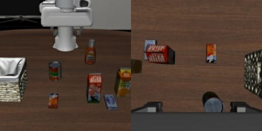
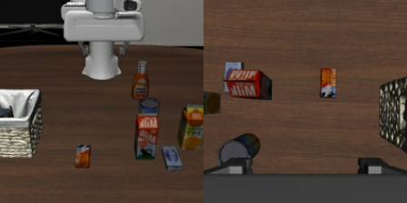
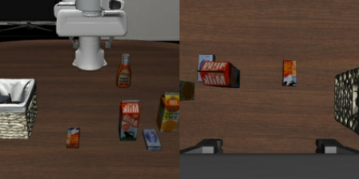

# 给 X：006 主动观察与合理试探诊断（非启动闸门）

日期：2026-10-09。作者：Codex。状态：open（非阻塞诊断；原可观察性启动闸门撤销）。阶段：Stage03。
代码由X实现；真实状态/渲染与模型实验由Codex执行。该任务不增加主metric、不训练，不按VLA失败筛状态。
用户再次明确允许“简单观察、简单尝试后意识到”；初始遮挡、缺少单帧直接完成证据属于被测挑战，不据此停跑/筛状态。本修订覆盖旧006和preflight1中的强制前置要求；文件名保留以免历史链接失效。X优先交付005，不等待本任务完成才启动主pilot。

## 发现与证据

固定5来源的20状态和40次独立150-step回放全部技术通过，但不等于完成状态可观察。
Codex已读step0 NPZ双相机，并在模型Python中复用真实adapter调用链：
`_raw_observation(wrist=True, proprio=True)` → `prepare_observation/get_image_resize_size` → `prepare_images_for_vla(center_crop=True)`。
无policy、权重或HF processor加载；以下是HF processor前RGB，不声称最终encoder tensors。
源manifest文件SHA-256 `50c557f087783d7aa346992f4449dc81c1c59302e8850b3a3bee1c820c18797d`；OFT helper源码SHA-256 `eed754d7c5f9821aae2fe0531dbe01df8c11df0d5c79b4aeeb9bb4452124bdf5`。

初态0，左agentview、右wrist，原始模型视图内容，无箭头/真值标记：

已完成物体位于篮子中，但篮子在主视角边缘且内容物遮挡，腕部初始视角未清楚覆盖内部。图中明显变化是桌面上相应物体缺失；尚不能仅凭此认证“完成目标在当前传感器中可辨认”。
这不是已证明不可观察，也不判整个bank无效：缺物体本身是线索，模型可以查看桌面、进行合理试抓、走近篮子/移动腕部视角，再更新行动。桌面缺失并非完成的充分证明，但不能因此要求起点直接展示答案。没有证据证明允许的观察/试探也无法获取信息；不把“初图不清晰”升级成无效状态。

## 诊断交付，不改变场景难度

在 `responses/006_round1.md` 给出UIR标注/行为诊断建议：哪些是必要信息获取，哪些是无必要重做，哪些unknown；依据可用观测/反馈和行为变化，不要求推断内部“意识”。
允许：确认桌面目标是否存在、无破坏的合理试抓/空抓反馈、寻找篮子、移动腕部相机观察、必要释放/撤离；这些不自动计UIR。
失败证据候选：获得缺失/空抓反馈后，持续同样无效操作而不获取新线索、不推进可见剩余目标；或明确把已完成对象重新执行完整任务操作。不能机械地以一次失败抓取、闭爪次数、动作长度判UIR，不能把8步chunk中的闭爪命令当8次独立尝试。无法判断必要性保留unknown。

无需为了初始显眼而重摆已完成目标，也不要求先提供专家观察轨迹。若后续失败解释需要，可提出有限的独立信息可获取性诊断，但先登记用途；不得把专家轨迹先执行给主模型、不得提供mask或剩余提示。

物理合法/恢复正确/目标定义成立仍须检查；剩余执行诊断成功是可执行正证据，失败只未证实。只有确切物理错误、任务本身不成立，或有充分证据证明在允许交互下信息也不可获取，才另报状态有效性问题；不能从初始遮挡推出这些结论。

## 禁止和实现边界

- 不改变主模型的camera、center_crop、processor、checkpoint、原完整指令，不插入mask/标记/分割真值到模型输入。
- 不移动背景、容器、机器人起点去救一组，再声称仍是原配对状态；这些变更若必须做，先明确报告并重新设计对照，不能自动授权。
- 不读取被测VLA的成功率决定选择哪些候选；不丢失败来源或增加容易index。
- 不改旧run/manifest/replay/截图；保留当前001状态，不因遮挡自动重建为更简单的场景。
- 默认只交诊断/标注建议，不额外开发可见性分类器或过滤器。确有代码需要时先说明，最小CPU/fake测试并独立提交；X不跑GPU、不自行合并。
- 不允许无限尝试；本任务不阻塞005验收和原始15条探索性主pilot。

005验收、技术/基本语义核对和身份冻结后，Codex在当前固定来源上执行主pilot。006及剩余执行对照用于解释结果，不将“未得到对照成功”当作物理不可达或筛掉原模型失败的理由。正式因果主张仍须充分证据。UIR人工审核，主表仍只有JSR/UIR。
